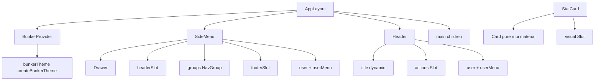

# Plan Técnico — Extracción de la Carcasa Visual (Dashboard Layout) a `packages/ui`

> Estado: **APROBADO** para implementación en modo Code.
> Este documento supersede el borrador previo de extracción.

## 0. Contexto y decisiones de diseño

Hallazgos relevantes del estado actual:

- `packages/ui/src/BunkerProvider.tsx` ya existe pero está **hardcodeado en modo oscuro**, sin `mode`, y vive en la raíz de `src/` en lugar de un módulo de tema.
- El barril `packages/ui/src/index.ts` expone hoy `BunkerBadge`, `BunkerProvider`, `ActionCard` y algunos primitivos MUI.
- `packages/ui/package.json` **no tiene** dependencias `@mui/x-*`: la poda de dependencias pesadas ya se cumple a nivel de manifiesto. El riesgo real es la importación accidental de `@mui/x-charts` / `@mui/x-data-grid` al portar el donante.
- El donante `docs/MUI_DASHBOARD_DONOR.md` contiene datos estáticos (`Riley Carter`, `riley@email.com`, menús cerrados, `SparkLineChart`, `xThemeComponents`) que **deben morir** en la extracción.
- La decisión ADR-002 y la Regla 3 de `docs/DECISIONS.md` mandan desacoplar todo texto/dato estático vía props.

Principios rectores aplicados:

1. **Aislamiento**: todo el código visual en `packages/ui`. Cero `@mui/material` fuera del paquete.
2. **Agnosticismo total**: cero textos CRM, cero rutas fijas, cero elementos de menú cerrados, cero datos inventados. Todo entra por props tipadas.
3. **Poda**: se elimina `@mui/x-charts` (SparkLineChart) y se descarta `@mui/x-data-grid`. Solo primitivos `@mui/material` + `@mui/icons-material`.
4. **TypeScript estricto**: prohibido `any`; toda prop con `interface` explícita y exportada.

> Decisión de diseño clave: los elementos "ricos" del donante que arrastraban dependencias pesadas (gráfico sparkline en `StatCard`, selector/alertas del `SideMenu`, buscador/date-picker del `Header`) se sustituyen por **Slots de composición (`ReactNode`)**. Así el paquete permanece ligero y el consumidor inyecta su propia implementación.

---

## 1. Árbol de archivos propuesto dentro de `packages/ui/src/`

```
packages/ui/src/
├── index.ts                         # Barril raíz (se amplía, no se rompe)
├── BunkerBadge.tsx                  # existente (sin cambios)
├── ActionCard.tsx                   # existente (sin cambios)
├── theme/
│   ├── BunkerProvider.tsx           # MOVIDO desde src/ y ampliado (light/dark)
│   ├── bunkerTheme.ts               # Factory createBunkerTheme(mode, tokens)
│   └── index.ts                     # Barril del módulo de tema
└── components/
    ├── layout/
    │   ├── types.ts                 # Interfaces compartidas (NavItem, NavGroup, ...)
    │   ├── SideMenu.tsx             # Navegación lateral (Drawer) paramétrica
    │   ├── Header.tsx               # Barra superior (AppBar) paramétrica
    │   ├── AppLayout.tsx            # Ensambla SideMenu + Header + children
    │   └── index.ts                 # Barril de layout
    └── cards/
        ├── StatCard.tsx             # Tarjeta de métricas (Card puro, sin x-charts)
        └── index.ts                 # Barril de cards
```

Notas de migración:

- `packages/ui/src/BunkerProvider.tsx` **se mueve** a `theme/BunkerProvider.tsx`. El barril raíz reexportará desde la nueva ruta para no romper consumidores actuales.
- Se crea `theme/bunkerTheme.ts` para separar el _theme factory_ (lógica de tokens) del componente proveedor (presentación). Esto facilita testear y evita mezclar `createTheme` dentro del render.

---

## 2. Interfaces TypeScript completas y exportadas

### 2.1 Tipos compartidos — `components/layout/types.ts`

```typescript
import type { ReactNode } from "react";

/** Modo de color soportado por el chasis. */
export type ThemeMode = "light" | "dark";

/** Elemento de navegación individual. Agnóstico: sin rutas ni textos fijos. */
export interface NavItem {
  /** Identificador único y estable del ítem. */
  id: string;
  /** Texto visible del ítem. */
  label: string;
  /** Icono opcional renderizado a la izquierda. */
  icon?: ReactNode;
  /** Destino declarativo (href) o manejado por onNavigate. */
  href?: string;
  /** Indica si el ítem está activo/seleccionado. */
  selected?: boolean;
  /** Deshabilita la interacción. */
  disabled?: boolean;
}

/** Agrupación lógica de ítems de navegación (secciones primarias/secundarias). */
export interface NavGroup {
  /** Identificador único del grupo. */
  id: string;
  /** Etiqueta accesible opcional del grupo. */
  ariaLabel?: string;
  /** Ítems que componen el grupo. */
  items: NavItem[];
}

/** Datos mínimos del usuario para el pie del menú y el header. */
export interface ShellUser {
  /** Nombre visible. */
  name: string;
  /** Correo o identificador secundario. */
  email?: string;
  /** URL del avatar. */
  avatarSrc?: string;
  /** Texto alternativo del avatar. */
  avatarAlt?: string;
}

/** Migaja de pan para el header. */
export interface BreadcrumbItem {
  /** Etiqueta visible. */
  label: string;
  /** Destino opcional. */
  href?: string;
}
```

### 2.2 `BunkerProvider` — `theme/BunkerProvider.tsx`

```typescript
import type { ReactNode } from "react";
import type { ThemeMode } from "../components/layout/types";

/** Tokens de color sobreescribibles por el consumidor. */
export interface BunkerThemeTokens {
  /** Color primario (main). */
  primaryMain?: string;
  /** Fondo por defecto (background.default). */
  backgroundDefault?: string;
  /** Fondo de superficies (background.paper). */
  backgroundPaper?: string;
}

/** Props del proveedor de tema del Búnker. */
export interface BunkerProviderProps {
  /** Árbol de la aplicación. */
  children: ReactNode;
  /** Modo de color activo. Por defecto: 'dark'. */
  mode?: ThemeMode;
  /** Sobreescritura opcional de tokens de color. */
  tokens?: BunkerThemeTokens;
  /** Inyecta CssBaseline. Por defecto: true. */
  withCssBaseline?: boolean;
}
```

### 2.3 `SideMenu` — `components/layout/SideMenu.tsx`

```typescript
import type { ReactNode } from "react";
import type { NavGroup, NavItem, ShellUser } from "./types";

/** Props del menú lateral adaptable. */
export interface SideMenuProps {
  /** Grupos de navegación (obligatorio). */
  groups: NavGroup[];
  /** Ancho del drawer en px. Por defecto: 240. */
  width?: number;
  /** Cabecera del drawer (logo, marca, selector). Slot libre. */
  headerSlot?: ReactNode;
  /** Contenido bajo la navegación (alertas, cards). Slot libre. */
  footerSlot?: ReactNode;
  /** Usuario mostrado en el pie del drawer. */
  user?: ShellUser;
  /** Menú de acciones del usuario (inyectado, p. ej. PopoverMenu). */
  userMenu?: ReactNode;
  /** Callback al seleccionar un ítem. */
  onNavigate?: (item: NavItem) => void;
  /** Control de apertura en viewports móviles. */
  open?: boolean;
  /** Callback de cierre (móvil). */
  onClose?: () => void;
}
```

### 2.4 `Header` — `components/layout/Header.tsx`

```typescript
import type { ReactNode } from "react";
import type { BreadcrumbItem, ShellUser } from "./types";

/** Props de la barra superior. */
export interface HeaderProps {
  /** Título dinámico de la vista (obligatorio). */
  title: string;
  /** Subtítulo opcional. */
  subtitle?: string;
  /** Migajas de pan opcionales. */
  breadcrumbs?: BreadcrumbItem[];
  /** Acciones a la derecha (búsqueda, botones). Slot libre. */
  actions?: ReactNode;
  /** Usuario para el bloque de perfil. */
  user?: ShellUser;
  /** Menú/acciones del usuario (inyectado). */
  userMenu?: ReactNode;
  /** Muestra el botón hamburguesa (móvil). */
  showMenuButton?: boolean;
  /** Callback de apertura del menú lateral. */
  onMenuToggle?: () => void;
  /** Modo de color actual para el toggle. */
  colorMode?: "light" | "dark";
  /** Callback de alternancia de modo de color. */
  onColorModeToggle?: () => void;
}
```

### 2.5 `AppLayout` — `components/layout/AppLayout.tsx`

```typescript
import type { ReactNode } from "react";
import type { BreadcrumbItem, NavGroup, ShellUser, ThemeMode } from "./types";

/** Props del contenedor que ensambla SideMenu + Header + children. */
export interface AppLayoutProps {
  /** Grupos de navegación para el SideMenu. */
  navGroups: NavGroup[];
  /** Título dinámico mostrado en el Header. */
  title: string;
  /** Contenido principal de la aplicación. */
  children: ReactNode;
  /** Subtítulo opcional del Header. */
  subtitle?: string;
  /** Migajas de pan del Header. */
  breadcrumbs?: BreadcrumbItem[];
  /** Acciones del Header (buscador, notificaciones). Slot libre. */
  headerActions?: ReactNode;
  /** Cabecera del SideMenu (marca/selector). Slot libre. */
  sideMenuHeader?: ReactNode;
  /** Contenido inferior del SideMenu (alertas). Slot libre. */
  sideMenuFooter?: ReactNode;
  /** Usuario del shell. */
  user?: ShellUser;
  /** Menú de usuario inyectado. */
  userMenu?: ReactNode;
  /** Ancho del drawer. Por defecto: 240. */
  drawerWidth?: number;
  /** Modo de color (si el layout gestiona el tema). */
  mode?: ThemeMode;
  /** Callback de alternancia de modo de color. */
  onColorModeToggle?: () => void;
  /**
   * Si es false, AppLayout NO envuelve con BunkerProvider
   * (útil cuando la app ya monta su propio provider). Por defecto: true.
   */
  withProvider?: boolean;
  /** Ancho máximo del área de contenido. Por defecto: 1700. */
  contentMaxWidth?: number | string;
}
```

### 2.6 `StatCard` — `components/cards/StatCard.tsx`

```typescript
import type { ReactNode } from "react";

/** Dirección de la tendencia. */
export type StatTrendDirection = "up" | "down" | "neutral";

/** Metadato de tendencia de la métrica. */
export interface StatCardTrend {
  /** Dirección semántica. */
  direction: StatTrendDirection;
  /** Etiqueta visible (p. ej. "+25%"). */
  label: string;
}

/** Props de la tarjeta genérica de métricas. */
export interface StatCardProps {
  /** Título de la métrica (obligatorio). */
  title: string;
  /** Valor principal (obligatorio, string para formateo externo). */
  value: string;
  /** Intervalo o contexto temporal (p. ej. "Last 30 days"). */
  interval?: string;
  /** Tendencia opcional con dirección y etiqueta. */
  trend?: StatCardTrend;
  /** Icono opcional junto al título. */
  icon?: ReactNode;
  /**
   * Slot de visualización inferior (reemplaza el SparkLineChart del donante).
   * El consumidor decide si pinta sparkline, barra o nada.
   */
  visual?: ReactNode;
  /** Acción al hacer click en la tarjeta. */
  onClick?: () => void;
}
```

### 2.7 Barriles (`index.ts`)

- `theme/index.ts`: `export * from './BunkerProvider'; export * from './bunkerTheme';`
- `components/layout/index.ts`: `export * from './types'; export * from './SideMenu'; export * from './Header'; export * from './AppLayout';`
- `components/cards/index.ts`: `export * from './StatCard';`
- `src/index.ts` (raíz): se amplía reexportando `./theme`, `./components/layout`, `./components/cards`, manteniendo `BunkerBadge`, `ActionCard` y los primitivos MUI existentes.

---

## 3. Contratos de aislamiento (invariantes verificables en Code)

| Regla                                        | Verificación                                                                   |
| -------------------------------------------- | ------------------------------------------------------------------------------ |
| Solo `@mui/material` + `@mui/icons-material` | `search_files` de `@mui/x-` en `packages/ui/src` debe dar 0 resultados         |
| Cero `any`                                   | `tsc` estricto sin errores; grep de `: any`                                    |
| Cero textos de negocio                       | grep de literales como `Clients`, `Riley Carter`, `riley@email.com` debe dar 0 |
| Cero rutas fijas                             | grep de `"/home"`, `"/analytics"` etc. debe dar 0                              |
| Toda prop tipada y exportada                 | cada `interface *Props` con `export`                                           |
| `apps/*` no importa MUI directo              | grep de `@mui/material` en `apps/` debe dar 0                                  |

---

## 4. Diagrama de composición



---

## 5. Checklist atómico de implementación para el modo Code

El modo Code deberá ejecutar estos pasos **en orden**, uno por uno:

- [ ] **Paso 1 — Saneamiento de dependencias**: verificar que `packages/ui/package.json` no contenga `@mui/x-charts`, `@mui/x-data-grid`, `@mui/x-data-grid-pro`, `@mui/x-date-pickers` ni `@mui/x-tree-view`. Si existen, eliminarlas (sin instalar nada nuevo).
- [ ] **Paso 2 — Estructura de directorios**: crear `packages/ui/src/theme/`, `packages/ui/src/components/layout/`, `packages/ui/src/components/cards/`.
- [ ] **Paso 3 — Mover BunkerProvider**: reubicar `packages/ui/src/BunkerProvider.tsx` → `packages/ui/src/theme/BunkerProvider.tsx` y eliminar el original.
- [ ] **Paso 4 — Theme factory**: crear `theme/bunkerTheme.ts` con `createBunkerTheme(mode: ThemeMode, tokens?: BunkerThemeTokens)` que devuelva un `Theme` de MUI, sin `any`.
- [ ] **Paso 5 — BunkerProvider ampliado**: implementar `theme/BunkerProvider.tsx` con `BunkerProviderProps` (mode, tokens, withCssBaseline), tipado y exportado.
- [ ] **Paso 6 — Tipos compartidos**: crear `components/layout/types.ts` con `ThemeMode`, `NavItem`, `NavGroup`, `ShellUser`, `BreadcrumbItem` (todas exportadas).
- [ ] **Paso 7 — SideMenu**: implementar `components/layout/SideMenu.tsx` sobre `@mui/material/Drawer` + `List`, consumiendo `groups` y slots; sin textos ni rutas fijas; sin `@mui/x-*`.
- [ ] **Paso 8 — Header**: implementar `components/layout/Header.tsx` sobre `@mui/material/AppBar` + `Toolbar`, con `title` dinámico, `actions`, `user`, `breadcrumbs`; sin datos fijos; sin `CustomDatePicker`/`@mui/x-date-pickers`.
- [ ] **Paso 9 — StatCard**: implementar `components/cards/StatCard.tsx` con `@mui/material/Card` + `Typography` + `Chip`; sustituir `SparkLineChart` por el slot `visual: ReactNode`; derivar colores del tema (success/error/grey) sin `any`.
- [ ] **Paso 10 — AppLayout**: implementar `components/layout/AppLayout.tsx` ensamblando `BunkerProvider` (condicional a `withProvider`) + `SideMenu` + `Header` + `children`; estado de apertura móvil gestionado de forma interna solo como UI, no de negocio.
- [ ] **Paso 11 — Barriles**: crear `theme/index.ts`, `components/layout/index.ts`, `components/cards/index.ts` y ampliar `packages/ui/src/index.ts` reexportando todo sin romper los exports existentes (`BunkerBadge`, `ActionCard`, primitivos MUI).
- [ ] **Paso 12 — Auditoría de invariantes**: ejecutar búsquedas de `@mui/x-`, `: any`, textos del donante (`Riley Carter`, `riley@email.com`, `Clients`, `Analytics`) y confirmar 0 resultados en `packages/ui/src`.
- [ ] **Paso 13 — Build obligatorio**: ejecutar `pnpm --filter @bunker/ui run build` y confirmar compilación sin errores (puerta DoD, Regla 3 de engineering.md).
- [ ] **Paso 14 — Persistir el plano aprobado**: mantener este documento actualizado como fuente de trazabilidad.
