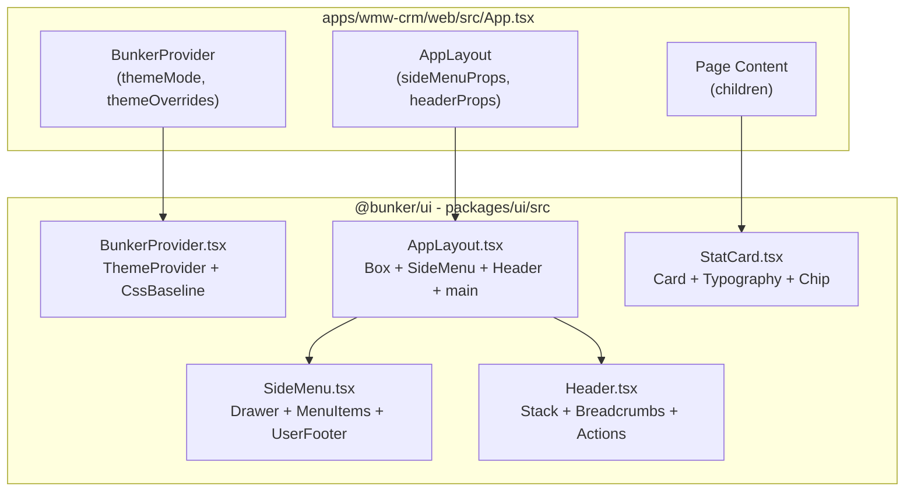

# Plan de Extracción: Dashboard Layout → `packages/ui`

> **Autor:** Modo Architect | **Fecha:** 2026-10-03
> **Objetivo:** Extraer la carcasa visual del Dashboard Layout desde el donante MUI hacia `packages/ui`, con cero acoplamiento a lógica de negocio y usando exclusivamente `@mui/material` puro.

---

## 1. Diagnóstico de la Situación Actual

### 1.1 Lo que ya existe en `packages/ui/src/`

| Archivo              | Estado                                                  | Acción                                                        |
| -------------------- | ------------------------------------------------------- | ------------------------------------------------------------- |
| `BunkerProvider.tsx` | Tema oscuro fijo, sin soporte claro/oscuro ni overrides | **Refactorizar** para soportar `themeMode` y `themeOverrides` |
| `BunkerBadge.tsx`    | Componente decorativo simple                            | **Conservar** sin cambios                                     |
| `ActionCard.tsx`     | Tarjeta genérica con title/description/button           | **Conservar** sin cambios                                     |
| `index.ts`           | Barril con 3 exports + re-export de `Box` y `Container` | **Ampliar** con nuevos componentes y primitivos               |

### 1.2 Lo que el donante MUI aporta (`docs/MUI_DASHBOARD_DONOR.md`)

| Componente donante | Línea    | Problemas detectados                                                                     | Acción de extracción                             |
| ------------------ | -------- | ---------------------------------------------------------------------------------------- | ------------------------------------------------ |
| `Dashboard.tsx`    | L7-72    | Acoplado a `AppTheme`, `x-charts`, `x-data-grid-pro`, `x-tree-view`                      | **No extraer** — reemplazar por `AppLayout`      |
| `SideMenu.tsx`     | L78-168  | Textos fijos ("Riley Carter", "riley@email.com"), menú hardcodeado, `CardAlert` acoplado | **Extraer** con props tipadas                    |
| `MenuContent.tsx`  | L174-228 | Ítems hardcodeados (`mainListItems`, `secondaryListItems`)                               | **Absorber** dentro de `SideMenu`                |
| `Header.tsx`       | L232-270 | `Search`, `CustomDatePicker`, `NavbarBreadcrumbs` hardcodeados                           | **Extraer** con slots genéricos                  |
| `StatCard.tsx`     | L274-407 | Dependencia de `@mui/x-charts/SparkLineChart`, `PropTypes`, `getDaysInMonth` hardcodeado | **Extraer** sin chart, solo `@mui/material` puro |

### 1.3 Dependencias prohibidas detectadas en el donante

| Librería               | Ubicación en el donante                 | Veredicto                                 |
| ---------------------- | --------------------------------------- | ----------------------------------------- |
| `@mui/x-charts`        | `SparkLineChart`, `lineClasses`         | ❌ **Podar** — StatCard no tendrá gráfico |
| `@mui/x-data-grid-pro` | `themeAugmentation`                     | ❌ **Podar** — Fuera de alcance           |
| `@mui/x-date-pickers`  | `themeAugmentation`, `CustomDatePicker` | ❌ **Podar** — Header usará slot genérico |
| `@mui/x-tree-view`     | `themeAugmentation`                     | ❌ **Podar** — Fuera de alcance           |
| `prop-types`           | `StatCard.propTypes`                    | ❌ **Podar** — Usamos TypeScript          |

---

## 2. Árbol de Archivos Propuesto

```
packages/ui/src/
├── index.ts                    # Barril de exportación (actualizado)
├── types.ts                    # Interfaces compartidas de todo el paquete
│
├── BunkerBadge.tsx             # [EXISTENTE] Sin cambios
├── ActionCard.tsx              # [EXISTENTE] Sin cambios
│
├── BunkerProvider.tsx          # [REFACTORIZADO] Soporte light/dark/system + overrides
│
├── AppLayout.tsx               # [NUEVO] Ensambla SideMenu + Header + children
├── SideMenu.tsx                # [NUEVO] Navegación lateral con props tipadas
├── Header.tsx                  # [NUEVO] Barra superior con slots genéricos
├── StatCard.tsx                # [NUEVO] Tarjeta de métricas (solo @mui/material)
│
└── primitives/
    └── index.ts                # [AMPLIADO] Re-exportaciones MUI (Box, Container, Stack, etc.)
```

---

## 3. Interfaces TypeScript Completas

Todas las interfaces residirán en un único archivo `packages/ui/src/types.ts` para mantener cohesión y facilitar el barril de exportación.

### 3.1 `BunkerProviderProps`

```typescript
import type { ThemeOptions } from "@mui/material/styles";

export interface BunkerProviderProps {
  /**
   * Modo de tema inicial.
   * - 'light': tema claro
   * - 'dark': tema oscuro
   * - 'system': sigue la preferencia del SO (via prefers-color-scheme)
   *
   * @default 'dark'
   */
  themeMode?: "light" | "dark" | "system";

  /**
   * Overrides parciales del tema MUI que se fusionan con el tema base del Búnker.
   * Útil para que cada app personalice su palette, tipografía, etc.
   */
  themeOverrides?: ThemeOptions;

  /** Contenido envuelto por el ThemeProvider y CssBaseline. */
  children: React.ReactNode;
}
```

### 3.2 `MenuItem` y `SideMenuProps`

```typescript
export interface MenuItem {
  /** Identificador único del ítem (usado como key y para comparar activePath). */
  id: string;
  /** Texto a mostrar en el ítem. */
  label: string;
  /** Icono de MUI (ReactNode, típicamente <SvgIcon />). */
  icon: React.ReactNode;
  /** Ruta o identificador de navegación asociado. */
  path?: string;
  /** Si el ítem está deshabilitado. */
  disabled?: boolean;
  /** Contenido opcional de badge (número, chip, etc.). */
  badge?: React.ReactNode;
}

export interface SideMenuUserInfo {
  /** Nombre visible del usuario. */
  name: string;
  /** Email o identificador secundario. */
  email?: string;
  /** URL de la imagen de avatar. */
  avatarSrc?: string;
  /** Texto alternativo del avatar. */
  avatarAlt?: string;
}

export interface SideMenuProps {
  /**
   * Ancho del drawer en píxeles.
   * @default 240
   */
  drawerWidth?: number;

  /** Ítems del menú principal (sección superior, visible siempre). */
  mainMenuItems: MenuItem[];

  /** Ítems del menú secundario (sección inferior, separada por Divider). */
  secondaryMenuItems?: MenuItem[];

  /** ID del ítem actualmente activo para resaltar selección. */
  activeItemId?: string;

  /** Callback invocado al hacer clic en cualquier ítem del menú. */
  onNavigate?: (item: MenuItem) => void;

  /** Información del usuario para el footer del drawer. Si no se provee, se oculta el footer. */
  userInfo?: SideMenuUserInfo;

  /** Slot de branding/logotipo en la parte superior del drawer. */
  branding?: React.ReactNode;

  /**
   * Variante del drawer según MUI.
   * - 'permanent': siempre visible en desktop, oculto en mobile (controlado por CSS).
   * - 'temporary': drawer tipo modal controlado por open/onClose.
   *
   * @default 'permanent'
   */
  variant?: "permanent" | "temporary";

  /** Solo para variant='temporary': controla si el drawer está abierto. */
  open?: boolean;

  /** Solo para variant='temporary': callback para cerrar el drawer. */
  onClose?: () => void;

  /** Slot para contenido extra entre el menú secundario y el footer de usuario. */
  footerSlot?: React.ReactNode;
}
```

### 3.3 `BreadcrumbItem`, `HeaderAction` y `HeaderProps`

```typescript
export interface BreadcrumbItem {
  /** Texto visible del breadcrumb. */
  label: string;
  /** Ruta o identificador opcional para navegación. */
  path?: string;
}

export interface HeaderAction {
  /** Identificador único (usado como key). */
  id: string;
  /** Icono o contenido React a renderizar. */
  icon: React.ReactNode;
  /** Tooltip / aria-label del botón de acción. */
  label: string;
  /** Si debe mostrar un badge de notificación. */
  showBadge?: boolean;
  /** Contenido del badge (número, string, etc.). */
  badgeContent?: React.ReactNode;
  /** Callback al hacer clic en la acción. */
  onClick?: () => void;
}

export interface HeaderProps {
  /** Título principal de la página (se renderiza como Typography h1). */
  title?: string;

  /** Breadcrumbs jerárquicos para navegación. */
  breadcrumbs?: BreadcrumbItem[];

  /** Acciones del lado derecho (notificaciones, perfil, modo oscuro, etc.). */
  actions?: HeaderAction[];

  /** Callback al hacer clic en un breadcrumb. */
  onBreadcrumbClick?: (item: BreadcrumbItem) => void;

  /**
   * Slot izquierdo personalizado. Si se provee, reemplaza title + breadcrumbs.
   * Útil para barras de búsqueda, filtros, etc.
   */
  leftSlot?: React.ReactNode;

  /**
   * Slot derecho personalizado. Si se provee, reemplaza actions.
   * Útil para conjuntos de botones complejos.
   */
  rightSlot?: React.ReactNode;
}
```

### 3.4 `AppLayoutProps`

```typescript
export interface AppLayoutProps {
  /** Props que se pasan íntegramente a SideMenu. */
  sideMenuProps: SideMenuProps;

  /** Props que se pasan íntegramente a Header. */
  headerProps: HeaderProps;

  /** Contenido principal de la página (children). */
  children: React.ReactNode;

  /** Si debe mostrar el Header. @default true */
  showHeader?: boolean;

  /** Si debe mostrar el SideMenu. @default true */
  showSideMenu?: boolean;

  /**
   * Ancho máximo del área de contenido principal.
   * @default '100%'
   */
  maxContentWidth?: string | number;
}
```

> **Nota de diseño:** `AppLayout` **no** envuelve con `BunkerProvider`. El `BunkerProvider` se aplica en el nivel superior de la app consumidora (ej: `App.tsx`). Esto mantiene la separación de responsabilidades: `AppLayout` solo ensambla la carcasa visual; el tema lo provee la app.

### 3.5 `StatCardProps`

```typescript
export type TrendDirection = "up" | "down" | "neutral";

export interface StatCardProps {
  /** Título descriptivo de la métrica (ej: "Total Donors"). */
  title: string;

  /** Valor principal a mostrar (ej: "1,234" o 1234). */
  value: string | number;

  /**
   * Dirección de la tendencia.
   * - 'up': verde (success)
   * - 'down': rojo (error)
   * - 'neutral': gris (default)
   */
  trend?: TrendDirection;

  /** Valor textual de la tendencia (ej: '+25%', '-5%', '0%'). */
  trendValue?: string;

  /** Texto descriptivo secundario (ej: 'vs. last month', 'in the last 30 days'). */
  description?: string;

  /** Icono decorativo opcional (ReactNode, típicamente un SvgIcon de MUI). */
  icon?: React.ReactNode;

  /**
   * Variante visual de la Card.
   * @default 'outlined'
   */
  variant?: "outlined" | "elevation";

  /** Callback al hacer clic en la tarjeta completa. */
  onClick?: () => void;
}
```

---

## 4. Diagrama de Ensamblaje



---

## 5. Checklist Atómico de Implementación

Cada ítem es una unidad de trabajo independiente que el modo Code puede ejecutar y verificar con `pnpm --filter @bunker/ui run build`.

### Fase 0 — Preparación del terreno

- [ ] **CHK-00:** Verificar que `packages/ui/package.json` no tenga dependencias prohibidas (`@mui/x-charts`, `@mui/x-data-grid`, `@mui/x-date-pickers`, `@mui/x-tree-view`). Confirmar que solo están `@mui/material`, `@mui/icons-material`, `@emotion/react`, `@emotion/styled`.

### Fase 1 — Tipos compartidos

- [ ] **CHK-01:** Crear `packages/ui/src/types.ts` con **todas** las interfaces definidas en la sección 3 de este documento. El archivo debe contener exclusivamente tipos (cero código ejecutable). Verificar que no hay `any` en ninguna interfaz.

### Fase 2 — Refactorización de `BunkerProvider`

- [ ] **CHK-02:** Refactorizar `packages/ui/src/BunkerProvider.tsx` para que:
  - Acepte `BunkerProviderProps` (importado de `types.ts`).
  - Soporte `themeMode`: `'light'`, `'dark'`, `'system'` (usando `useMediaQuery` para `prefers-color-scheme`).
  - Acepte `themeOverrides` y los fusione con el tema base mediante `deepmerge` o spread controlado.
  - Exporte un hook `useBunkerTheme()` que devuelva `{ mode, toggleTheme }` para que `Header` y otros componentes puedan alternar el tema.
  - Mantenga `CssBaseline` como hijo directo de `ThemeProvider`.

### Fase 3 — `SideMenu`

- [ ] **CHK-03:** Crear `packages/ui/src/SideMenu.tsx` que:
  - Use `Drawer` de `@mui/material` (no `@mui/material/Drawer` directo, sino desde el barrel).
  - Renderice `branding` (si se provee) en la parte superior con un `Divider` debajo.
  - Renderice `mainMenuItems` como `List` + `ListItemButton`, resaltando `activeItemId`.
  - Renderice `secondaryMenuItems` (si se proveen) debajo de otro `Divider`.
  - Renderice `footerSlot` (si se provee) entre menú secundario y footer de usuario.
  - Renderice `userInfo` (si se provee) como footer con `Avatar` + nombre/email.
  - Soporte responsive: en `xs` el drawer se oculta con CSS (`display: { xs: 'none', md: 'block' }`).
  - Para `variant='temporary'`, use `open`/`onClose` y `Drawer` modal.
  - Invocar `onNavigate(item)` al hacer clic en cualquier ítem.

### Fase 4 — `Header`

- [ ] **CHK-04:** Crear `packages/ui/src/Header.tsx` que:
  - Use `Stack` horizontal de `@mui/material`.
  - Si se provee `leftSlot`, lo renderice; si no, renderice `Breadcrumbs` de MUI con los `breadcrumbs` items.
  - Si se provee `rightSlot`, lo renderice; si no, renderice `actions` como `IconButton` con badge opcional.
  - Si `title` se provee y no hay `leftSlot`, lo muestre como `Typography` h1 antes de los breadcrumbs.
  - Sea responsive: oculto en `xs`, visible en `md` (`display: { xs: 'none', md: 'flex' }`).

### Fase 5 — `AppLayout`

- [ ] **CHK-05:** Crear `packages/ui/src/AppLayout.tsx` que:
  - Use `Box` con `display: 'flex'` como contenedor raíz.
  - Renderice condicionalmente `SideMenu` (si `showSideMenu !== false`).
  - Renderice un `Box component="main"` con `flexGrow: 1` y `overflow: 'auto'`.
  - Dentro de `main`, renderice condicionalmente `Header` (si `showHeader !== false`).
  - Renderice `children` debajo del Header dentro de un `Stack` con spacing.
  - Aplique `maxContentWidth` al contenedor de contenido.

### Fase 6 — `StatCard`

- [ ] **CHK-06:** Crear `packages/ui/src/StatCard.tsx` que:
  - Use **exclusivamente** `Card`, `CardContent`, `Typography`, `Chip`, `Stack`, `Box` de `@mui/material`.
  - **No** importe ni referencie `@mui/x-charts` ni `SparkLineChart`.
  - Renderice `icon` (si se provee) junto al título.
  - Renderice `value` como `Typography variant="h4"`.
  - Renderice `trendValue` como `Chip` con color semántico: `'up'` → `success`, `'down'` → `error`, `'neutral'` → `default`.
  - Renderice `description` como `Typography variant="caption"`.
  - Soporte `onClick` en la `Card` completa.
  - Soporte `variant` (`'outlined'` | `'elevation'`).

### Fase 7 — Barril de exportación y primitivos

- [ ] **CHK-07:** Actualizar `packages/ui/src/index.ts` para:
  - Exportar todos los tipos desde `types.ts`.
  - Exportar `BunkerProvider` y `useBunkerTheme`.
  - Exportar `AppLayout`.
  - Exportar `SideMenu`.
  - Exportar `Header`.
  - Exportar `StatCard`.
  - Mantener exports existentes (`BunkerBadge`, `ActionCard`).

- [ ] **CHK-08:** Ampliar `packages/ui/src/primitives/index.ts` (crear si no existe) con re-exportaciones de los primitivos MUI más usados:
  - `Box`, `Container`, `Stack`, `Grid2` (o `Grid`)
  - `Typography`, `Card`, `CardContent`, `Chip`
  - `Button`, `IconButton`, `Avatar`
  - `Divider`, `List`, `ListItemButton`, `ListItemIcon`, `ListItemText`
  - `Breadcrumbs`, `Link`
  - `Drawer`

### Fase 8 — Verificación final

- [ ] **CHK-09:** Ejecutar `pnpm --filter @bunker/ui run build` y verificar que compile sin errores.
- [ ] **CHK-10:** Verificar que ningún archivo en `packages/ui/src/` contenga la palabra `any` (excepto en comentarios).
- [ ] **CHK-11:** Verificar que ningún archivo en `packages/ui/src/` importe de `@mui/x-charts`, `@mui/x-data-grid`, `@mui/x-date-pickers`, `@mui/x-tree-view`, o `prop-types`.

---

## 6. Notas de Diseño para el Modo Code

1. **El `BunkerProvider` NO va dentro de `AppLayout`.** La app consumidora envuelve toda su aplicación con `BunkerProvider` en el nivel raíz. `AppLayout` solo ensambla la estructura visual (SideMenu + Header + children). Esto permite que una misma app tenga múltiples layouts o páginas sin el menú lateral.

2. **`SideMenu` absorbe `MenuContent`.** No se crea un componente separado `MenuContent`. La lógica de listas de navegación vive dentro de `SideMenu`, iterando sobre `mainMenuItems` y `secondaryMenuItems`.

3. **`StatCard` no tiene gráfico.** Se elimina por completo la dependencia de `@mui/x-charts`. Si en el futuro se necesita un sparkline, se podrá crear un componente aparte `SparkStatCard` que acepte un slot de gráfico genérico.

4. **El tema base del Búnker** (paleta oscura con `#0f172a` / `#1e293b` / `#0284c7`) se mantiene como default. El modo `'light'` invierte a una paleta clara razonable. El modo `'system'` usa `useMediaQuery('(prefers-color-scheme: dark)')`.

5. **Prohibido `any`.** Todas las props tienen interfaz explícita. Para slots genéricos se usa `React.ReactNode`.
